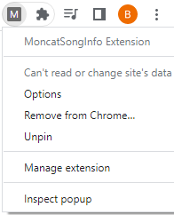
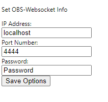

Google Chrome Extension to send song info to OBS

Setting up.

## Step 1: Setting up the Sources in OBS
Create two texts . one named song_title and one named song_artist and place them in the Scene.

## Step 2: Setting up OBS-Websocket in OBS
Set up the port number and password.

## Step 3: Setting up the Config in the Chrome Extension
Right click on the Extensions icon to get to the 'Options'.

The following page should show up. Set the IP, Port Number, and password to OBS-WEBSOCKET

## Step 4: Play a video from the website in the Chrome Browser
Go to the website and play a song. What is playing in the player should show up on OBS now.

